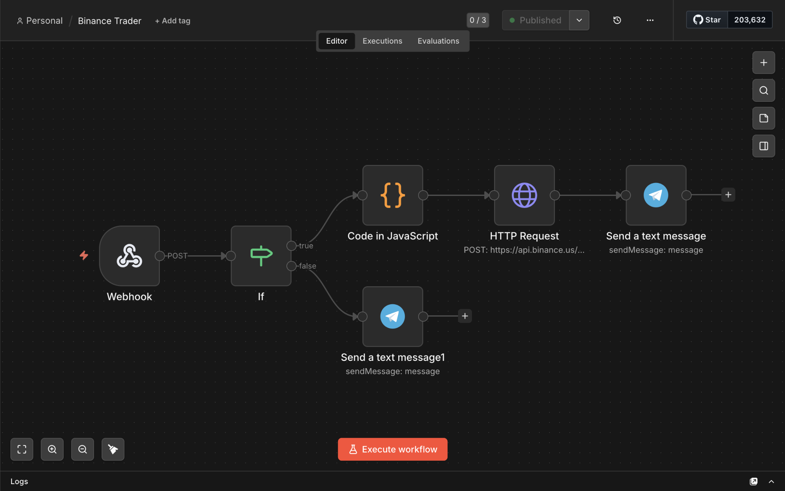

# AI-Khan-Bot

A trading bot that watches TradingView for RSI + EMA crossover signals and executes trades on Binance.US automatically. No manual order entry, no staring at charts all day — the signal fires, the bot trades, Telegram tells me what happened.

## How it works

1. **TradingView** runs a Pine Script strategy (RSI + EMA crossover) and fires a webhook alert when it triggers a buy/sell signal.
2. **ngrok** tunnels that alert into a self-hosted **n8n** instance.
3. **Webhook node** catches the POST request and hands it to an **If** node, which checks the action is actually `buy` or `sell` (anything else gets rejected).
4. **Code node** builds the Binance order payload and signs it with HMAC-SHA256, as required by the Binance API.
5. **HTTP Request node** sends the signed order to `api.binance.us`.
6. **Telegram node** sends a confirmation (or a rejection alert if the signal was invalid).

## Stack

- TradingView (Pine Script)
- ngrok
- n8n (self-hosted)
- Binance.US API
- Telegram Bot API

## Pairs monitored

BTCUSDT, ETHUSDT, SOLUSDT, XRPUSDT

## Notes

- The API secret is read from an environment variable, not hardcoded — set `BINANCE_API_SECRET` before running.
- This was built for my own use to automate a strategy I was executing manually. It trades real money on a real exchange, so treat the webhook endpoint and credentials accordingly.

## Disclaimer

Personal project, not financial advice, use at your own risk.
